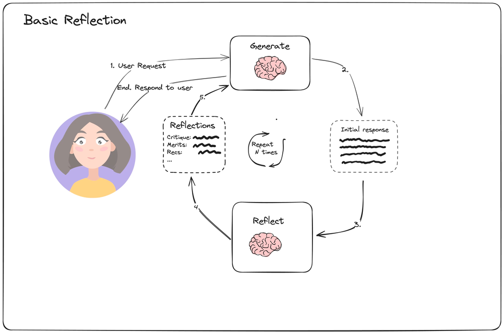

# Reflection Agent

> Reflection is a prompting strategy used to improve the quality and success rate of agents and similar AI systems. - LangChain blog

*Note: Pulling this example from the LangGraph course on Udemy by Shobha.*

*Source: <https://blog.langchain.dev/reflection-agents/>*

Example:
* [[LangGraph]] agent which refines twitter posts using the above method, it can iterate on the twitter post until it is good. 